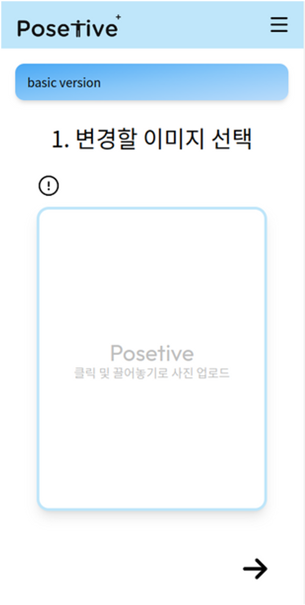
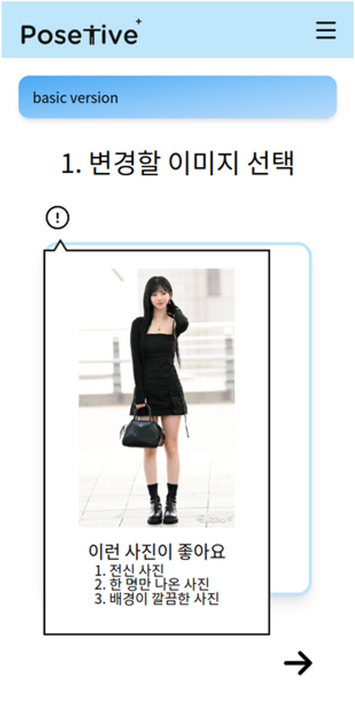
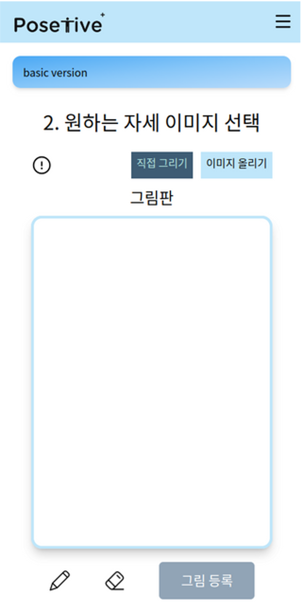
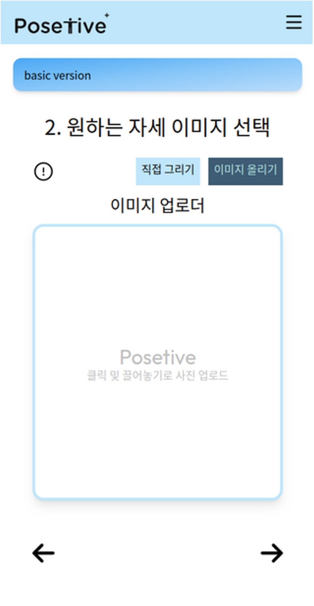
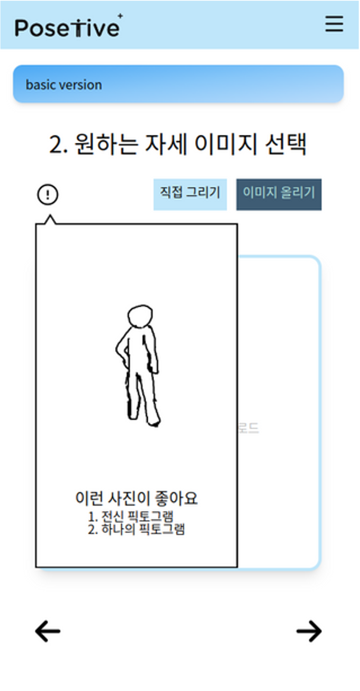
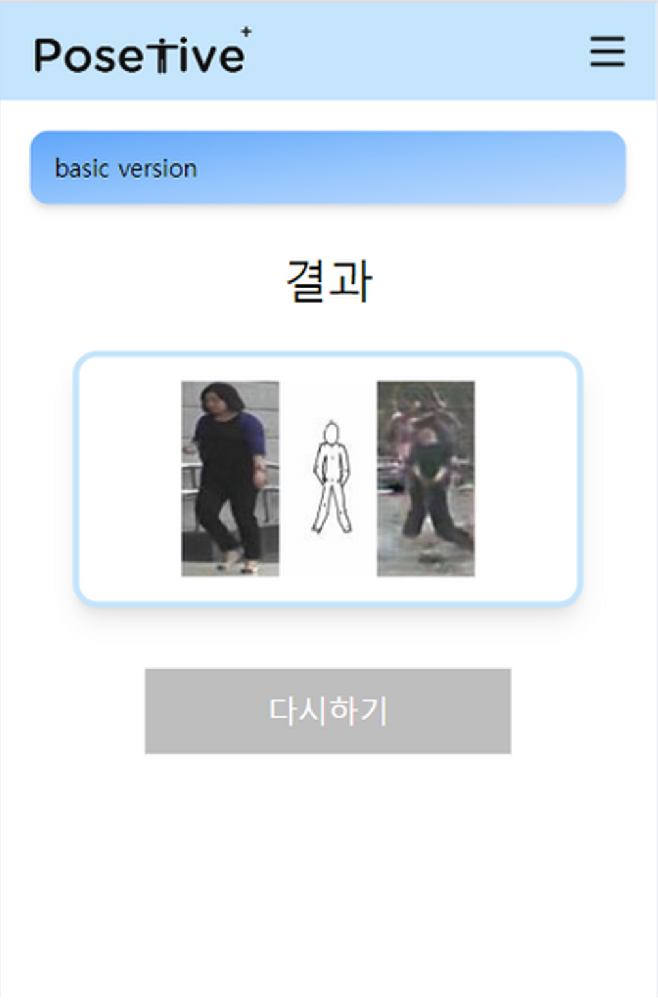

# 픽토그램 포즈 기반 사람 이미지 생성 모델

## 💻 서비스 화면

<table>
  <tr>
    <td></td>
    <td></td>
    <td></td>
  </tr>
  <tr>
    <td></td>
    <td></td>
    <td></td>
  </tr>
</table>


## ⚒️ Installation

### Build Environment
We recommend a python version `=3.9.12` and cuda version `=11.6`.
```bash
pip install -r requirements.txt
```

### Download Weights

1. Download trained weights from [Google Drive](https://drive.google.com/drive/folders/13dNqd87sLI6MbrxH9FloHBxah3atAJpa?usp=drive_link)

2. Then, these weights should be organized as follows:

   ```
   model
   |-- omnipose
   |   |-- checkpoint_ppe.pth
   |   |-- checkpoint_hpe.pth
   |   `...
   |-- pg2
   |   |-- checkpoints
   |   |   |-- PG2-1
   |   |   |   |-- events.out.tfevents.1566133862.wangbudui.39385.0
   |   |   |   `-- G1.pth
   |   |   `-- PG2-2
   |   |       |-- events.out.tfevents.1566139204.wangbudui.40174.0
   |   |       `-- G2.pth
   |   `...
   `...
   ```


## 🖌️ Inference

### Method 1) With Flask Server

1. Prepare `.env`  file to `./backend`

   ```ini
   ACCESS_KEY={s3_access_key}
   SECRET_KEY={s3_secret_key}
   REGION_KEY={s3_region}
   BUCKET_NAME={s3_bucket_name}
   ```

2. run `./backend/app.py`
3. request api to flask server
   - Method: POST
   - URI: '/pgpg'

### Method 2) Without Flask Server

```python
# 1. Declare variables
generation_id = {any_integer}
condition_image_url = {your_condition_image_url}
target_image_url = {your_target_image_url}

# 2. HPE + PPE
omnipose.run_infer.run_infer(generation_id, condition_image_url, target_image_url)

# 3. mpii2coco + generate annotation, pairs
pe2pg.Pe2Pg(generation_id).save_anno_csv()

# 4. generate posemap & mask
pg2.tool.generate_pose_map_add_mask.main("market", "inference", generation_id)

# 5. PG2
pg2.run.main(generation_id)
```


## 📝 What We Modified

### Files we modified from the existing implementation

- OmniPose
  - ./model/omnipose/train.py
  - ./model/omnipose/inference.py
  - ./model/omnipose/dataset/mpii.py
  - ./model/omnipose/experiments/mpii/omnipose_w48_256x256yaml.yaml
- PG2
  - ./model/pg2/run.py
  - ./model/pg2/generate.py
  - ./model/pg2/tool/generate_pose_map_add_mask.py
  - ./model/pg2/helper/custom_ignite_handlers/tensorboard_logger.py
  - ./model/pg2/implementations/PG2/data.py
  - ./model/pg2/implementations/PG2/stage1.toml
  - ./model/pg2/implementations/PG2/stage2.toml
- PE2PG (created)
  - ./model/pe2pg.py


## 🤗 Members

[강병욱](https://github.com/plain127), [김태인](https://github.com/Kim-Taein), [석예은](https://github.com/yenseok), [윤지현](https://github.com/Yoonnnnnnnnnn), [이진주](https://github.com/2realzoo), [한상우](https://github.com/1upright), [홍정현](https://github.com/JeonghyunHong)

